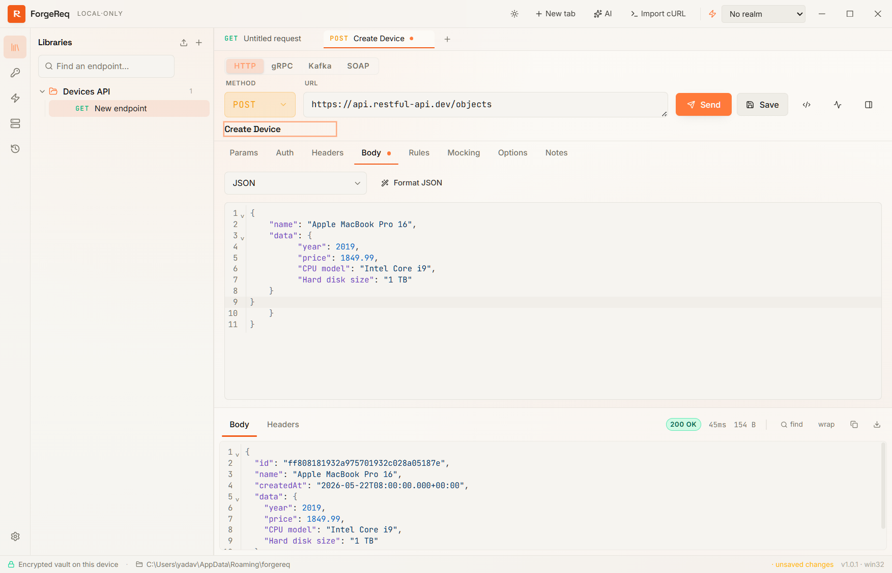
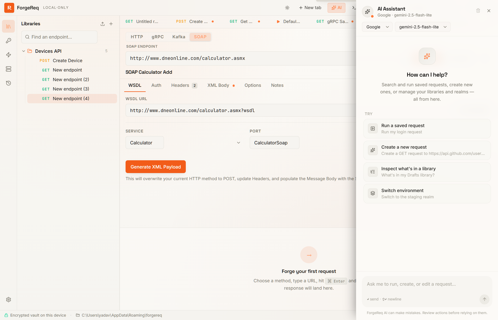
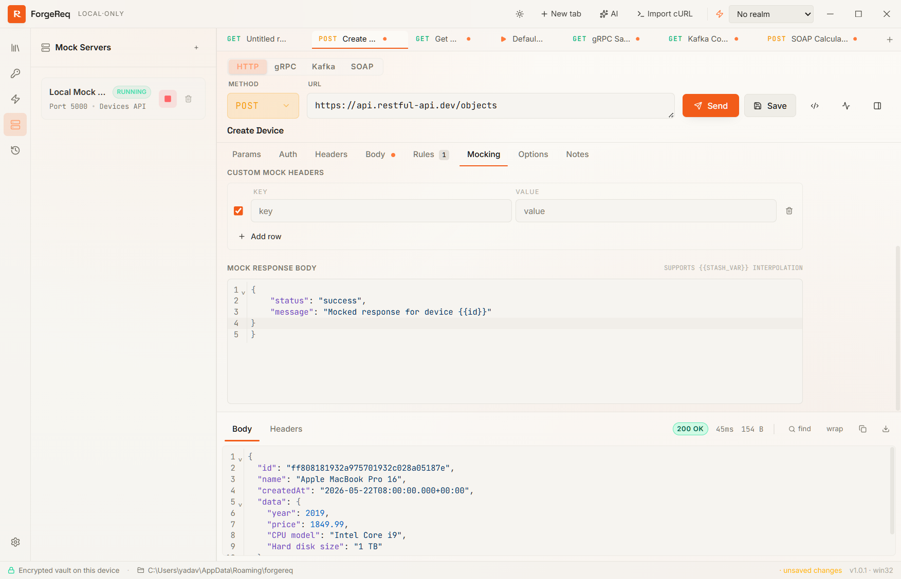
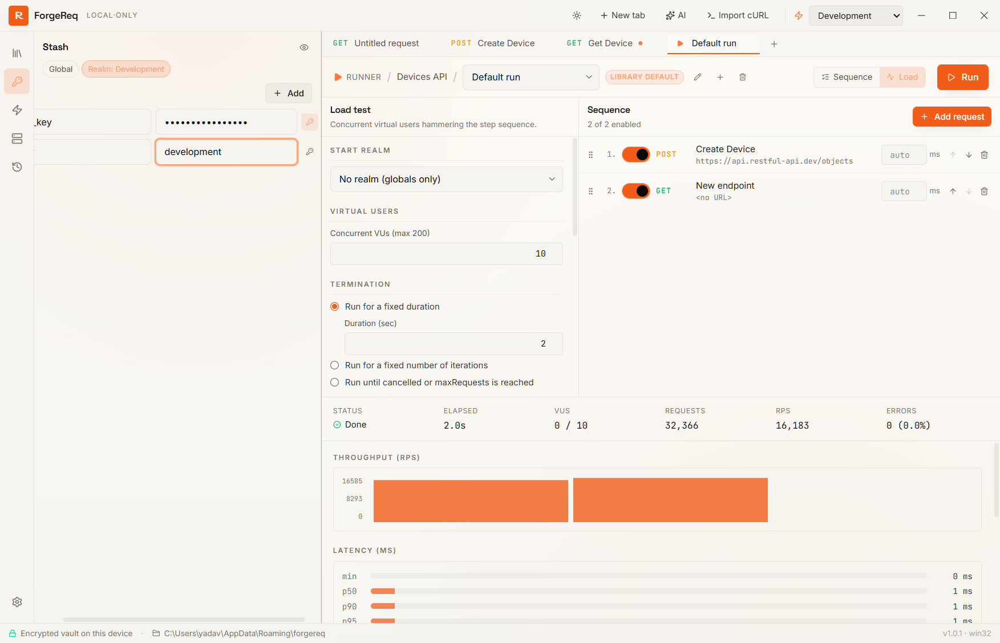
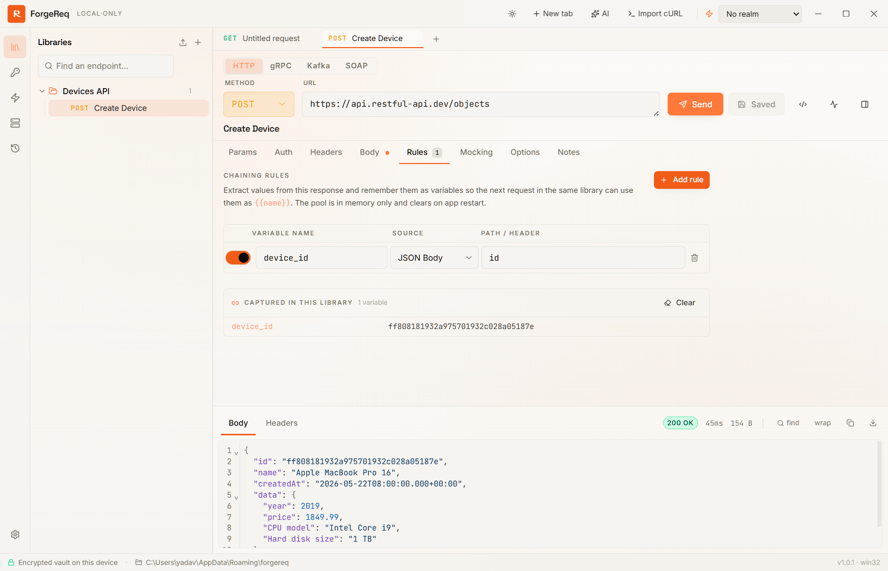
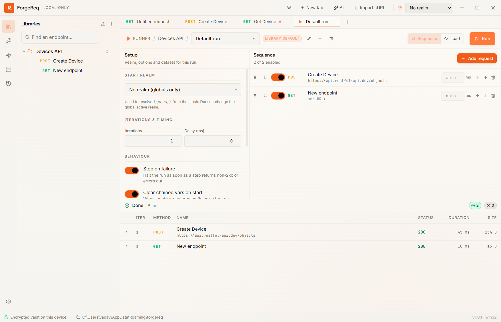

# ForgeReq: Desktop REST Client Releases

<p align="center">
  <strong>A privacy-first, local-only API testing client and workbench.</strong><br/>
  Forge requests. Keep your secrets at home.<br/>
  <br/>
  <strong><a href="https://forgereq.com/">🌐 Visit the Official Website: forgereq.com</a></strong>
</p>

<p align="center">
  <a href="https://apps.microsoft.com/detail/9P0WNX29G4CM?hl=en-us&gl=IN&ocid=pdpshare"></a>
  
  
  
  
</p>

---

## 🚀 Downloads & Installation

Get the latest installer matching your operating system from the **[Official Downloads Page](https://forgereq.com/)** or directly below:

### ❖ Windows
- **Microsoft Store (Recommended):** [Download from the Microsoft Store](https://apps.microsoft.com/detail/9P0WNX29G4CM?hl=en-us&gl=IN&ocid=pdpshare) for automatic updates and secure sandboxing.
- **Standalone/Portable:** Grab the `.exe` installer or portable `.zip` from the latest [GitHub Releases](../../releases/latest).

### ❖ macOS (Apple Silicon & Intel)
- Download the `.dmg` installer from the latest [GitHub Releases](../../releases/latest).
- *Unsigned launches:* Right-click the app icon and select "Open" on first launch, or remove the quarantine attribute:
  ```bash
  xattr -dr com.apple.quarantine /Applications/ForgeReq.app
  ```

### ❖ Linux
- Download `.AppImage` (runs on any distribution), `.deb` (Debian/Ubuntu), or `.rpm` (Fedora/RHEL) from the latest [GitHub Releases](../../releases/latest).

---

## 🌟 Key Features

### 1. Protocols
- **HTTP / REST:** Full support for HTTP methods, query parameters, headers, multipart form data, cookie management, redirects, proxy routing, and authentication (OAuth 2.0, Bearer, Basic).
- **gRPC:** Built-in compiler support. Simply paste your `.proto` file to auto-populate services and methods; supports stash variables and metadata.
- **Apache Kafka:** Produce messages or stream topic events in real-time. Connect securely to cloud clusters using SASL/PLAIN, SASL/SCRAM, and TLS.
- **SOAP:** Enter a WSDL URL to instantly parse and generate formatted XML request envelopes pre-filled with namespaces and schema parameters.

<p align="center">
  
</p>

### 2. Built-in Agentic AI Assistant
Bring your own API key (OpenAI, Anthropic, Google Gemini, Vertex AI, Azure, Grok, or local Ollama) and chat with a workspace-aware sidebar. The assistant doesn't just answer questions—it can autonomously create requests, add headers, parse JSON variables, or execute load tests on your behalf.

<p align="center">
  
</p>

### 3. Local Mock Servers
Instantly spin up a mock HTTP server from any collection library. Specify a port, status codes, response headers, and bodies (with support for variable replacement) to mock downstream services locally.

<p align="center">
  
</p>

### 4. Environments (Realms) & Variables (Stash)
Organize your keys, secrets, and configurations inside a three-layered variable resolver:
- **Global Stash:** Common variables shared across all environments.
- **Realms:** Dedicated environment overlays (e.g., `development`, `staging`, `production`) with non-empty override fallbacks.
- **Secrets Masking:** Keep tokens and passphrases masked in the UI and code snippets.

<p align="center">
  
</p>

### 5. Declarative Request Chaining (Rules)
No need to write javascript boilerplate. Create declarative Rules to extract response values (via JSON paths or headers) and bind them to variables for subsequent requests (e.g., auto-binding a login response token to authentication headers).

<p align="center">
  
</p>

### 6. Library Runner & Load Testing
Run multi-step request sequences powered by CSV/JSON datasets, or run stress tests using the parallel Load Runner with live throughput graphs and p50/p90/p95/p99 latency analysis.

<p align="center">
  
</p>

---

## 🔒 Privacy & Security

ForgeReq is built with a **strict privacy promise**:
- **No Account Required:** You never need to sign up or log in.
- **Local-First:** All requests, logs, history, and collections stay on your machine.
- **Zero Telemetry:** The app never phones home, collects cookies, or uploads usage statistics.
- **Encrypted at Rest:** Your local vault is encrypted using **AES-256-GCM**, secured via your operating system's keychain (macOS Keychain, Windows Credential Manager, or Linux libsecret).

---

## 📄 License & Community

ForgeReq is open-source software licensed under the **AGPL-3.0**. 

If you encounter bugs, have suggestions, or want to ask questions, please open an issue in this repository.
